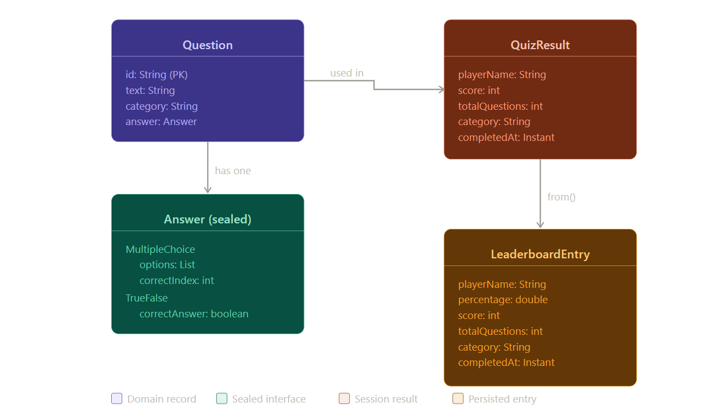

# Quiz Engine — Java REST API

A console and REST API quiz application built with Java 17 and Spring Boot.
Learners can attempt quizzes by category, receive instant scoring, and track
performance on a persistent leaderboard.

## Live API
Base URL: https://flexteckquiz-engine.up.railway.app

| Endpoint | Method | Description |
|---|---|---|
| `/api/quiz/start` | GET | Fetch questions (optional: `?category=java&limit=5`) |
| `/api/quiz/submit` | POST | Submit answers and receive score |
| `/api/quiz/categories` | GET | List all available categories |
| `/api/leaderboard` | GET | View top scores (optional: `?top=5`) |
| `/api/leaderboard/category?name=java` | GET | Filter leaderboard by category |

## Presentation Slides
[View Slides on Canva](https://canva.link/10vno837a2z9mtv)

## Screenshots
See the [/Screenshots](./Screenshots) folder for API responses and project state.

## Data Model

### Entities and Relationships

**Question** — the core entity. Each question belongs to one category and has
exactly one Answer. The Answer is a sealed type: either `MultipleChoice`
(containing a list of options and a correct index) or `TrueFalse` (containing
a boolean correct value).

**QuizResult** — created at the end of each session. Captures the player name,
score, total questions, category, and timestamp. One player can have many
QuizResults over time.

**LeaderboardEntry** — derived from a QuizResult via `LeaderboardEntry.from(result)`.
Stored persistently in JSON. Entries are ranked by percentage descending, with
ties broken by most recent completion time.

## Data Model Diagram


## Architecture
The project is structured in four layers:

- **Domain** — Java Records: `Question`, `Answer`, `QuizResult`, `LeaderboardEntry`
- **Repository** — JSON persistence via Jackson: `QuestionRepository`, `LeaderboardRepository`
- **Service** — Business logic: `QuizService`, `LeaderboardService`
- **Presentation** — REST API (Spring Boot) and Console CLI running side by side

## Tech Stack
| Layer | Technology |
|---|---|
| Language | Java 17 |
| Framework | Spring Boot 3.2 |
| Serialization | Jackson |
| Testing | JUnit 5, Mockito, MockMvc |
| Build | Maven |
| Hosting | Railway |
| Version Control | GitHub |

## Running Locally

**As a REST API:**
```bash
mvn spring-boot:run
```

**As a console app:**
```bash
mvn spring-boot:run -Dspring-boot.run.arguments=--cli
```

**Run tests:**
```bash
mvn test
```

## Test Coverage
43 tests across all layers — domain, repository, service, and API controllers.

## Author
Anthony Kanu (Flexteck)